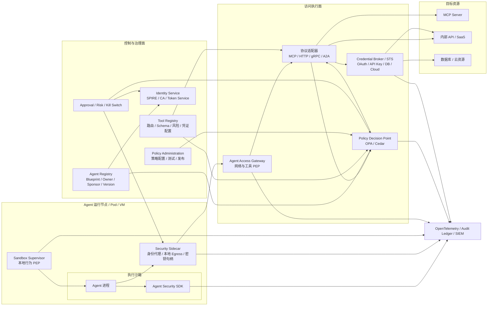
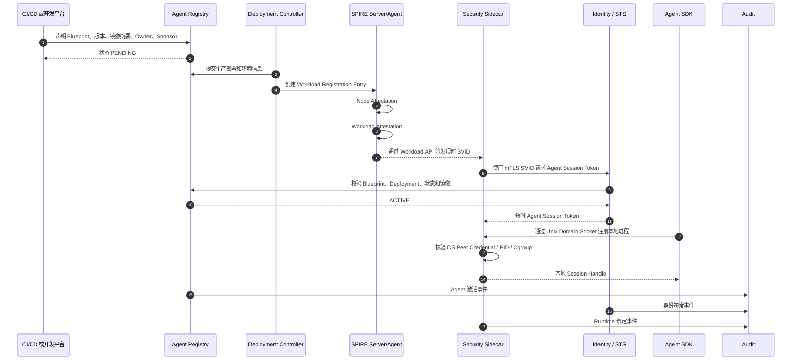
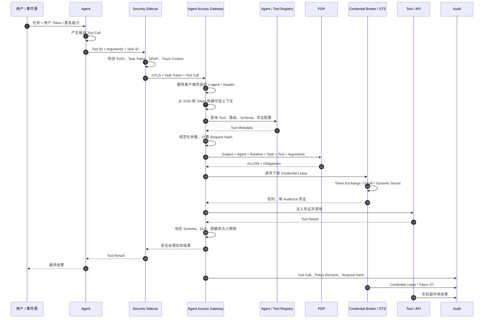
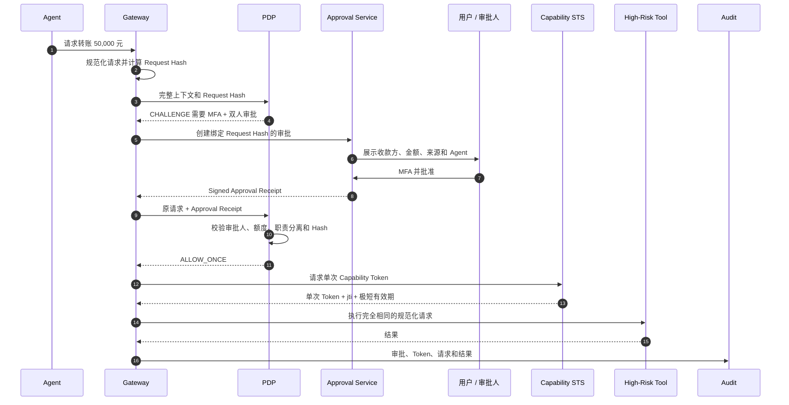
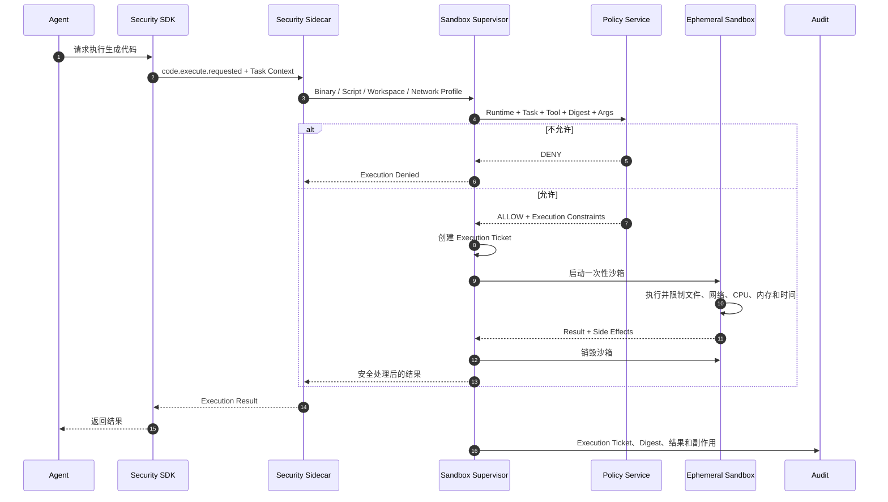
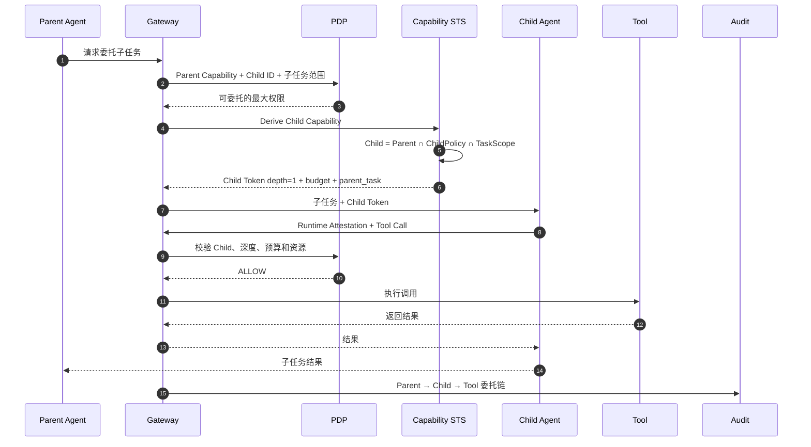
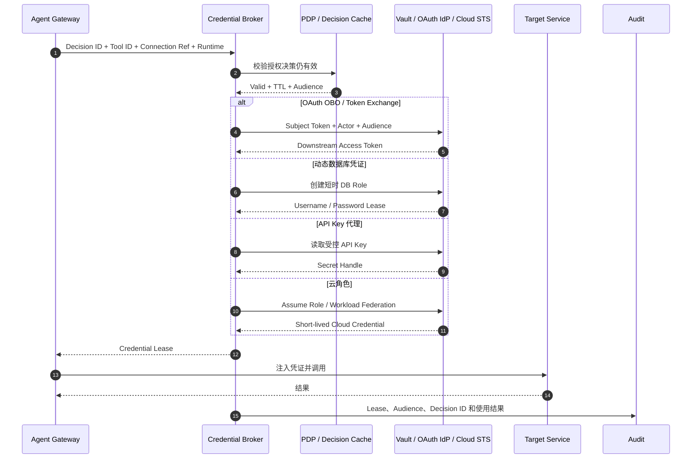
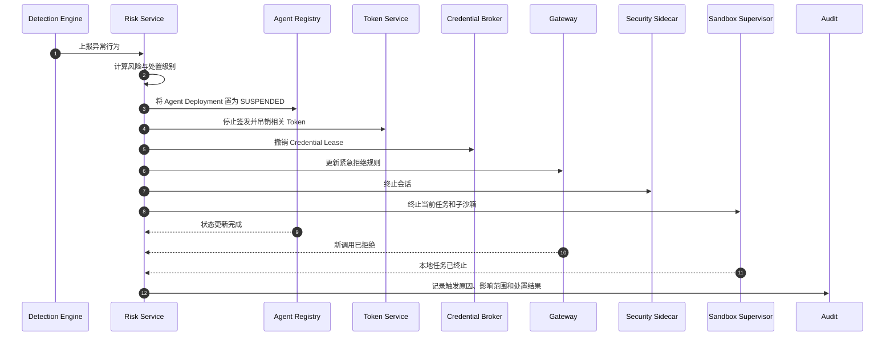
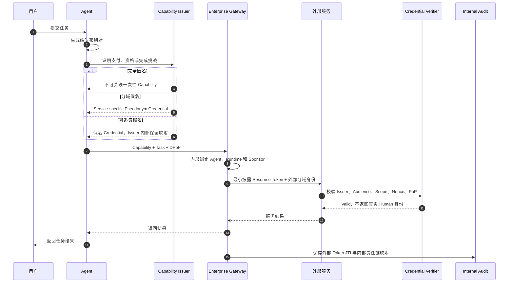

# Agent NHI 整体安全方案设计

> 文档类型：总体技术方案 / 架构设计说明书  
> 版本：v1.0  
> 日期：2026-07-15  
> 适用对象：安全架构、AI 平台、身份与访问管理、基础设施、研发效能、审计与合规团队

---

## 目录

1. [执行摘要](#1-执行摘要)
2. [建设背景与目标](#2-建设背景与目标)
3. [范围、假设与非目标](#3-范围假设与非目标)
4. [核心设计原则](#4-核心设计原则)
5. [信任边界与总体架构](#5-信任边界与总体架构)
6. [核心对象与身份模型](#6-核心对象与身份模型)
7. [模块一：Agent Security SDK](#7-模块一agent-security-sdk)
8. [模块二：执行沙箱](#8-模块二执行沙箱)
9. [模块三：Security Sidecar 与 Credential Guard](#9-模块三security-sidecar-与-credential-guard)
10. [模块四：Agent Access Gateway](#10-模块四agent-access-gateway)
11. [模块五：Agent Registry 与 Tool Registry](#11-模块五agent-registry-与-tool-registry)
12. [模块六：身份服务与 Token Service](#12-模块六身份服务与-token-service)
13. [模块七：权限策略服务](#13-模块七权限策略服务)
14. [模块八：Credential Broker](#14-模块八credential-broker)
15. [模块九：日志审计、风险检测与响应](#15-模块九日志审计风险检测与响应)
16. [关键数据模型与接口规范](#16-关键数据模型与接口规范)
17. [核心时序设计](#17-核心时序设计)
18. [策略模型与示例](#18-策略模型与示例)
19. [网络、运行时与部署设计](#19-网络运行时与部署设计)
20. [安全威胁与防护矩阵](#20-安全威胁与防护矩阵)
21. [Human 身份、匿名性与隐私设计](#21-human-身份匿名性与隐私设计)
22. [高可用、性能与容灾](#22-高可用性能与容灾)
23. [分阶段落地路线](#23-分阶段落地路线)
24. [MVP 范围与验收标准](#24-mvp-范围与验收标准)
25. [云环境适配建议](#25-云环境适配建议)
26. [关键决策与后续待定项](#26-关键决策与后续待定项)
27. [附录](#27-附录)

---

# 1. 执行摘要

本方案旨在建设一套面向企业级 AI Agent 的统一安全基础设施，覆盖 Agent 从创建、注册、部署、运行、工具调用、身份委托、凭证使用、行为审计到吊销下线的完整生命周期。

方案的核心定位是：

> **Agent Security Fabric：以工作负载身份为基础，以 Gateway 与 Sandbox 为强制执行点，以任务级能力 Token 为授权载体，以 Credential Broker 隔离长期凭证，以日志审计和风险响应形成闭环。**

原始构思包含六个模块：

- SDK 插件
- 沙箱
- API 代理网关
- 身份服务
- 权限策略服务
- 日志审计

在此基础上，本方案建议将系统重构为三个平面、九个逻辑模块：

| 平面 | 模块 | 核心职责 |
|---|---|---|
| 运行时安全面 | Agent Security SDK | 语义化 Hook、上下文传播、开发集成 |
| 运行时安全面 | 执行沙箱 | 文件、进程、网络、代码执行和资源隔离 |
| 运行时安全面 | Security Sidecar / Credential Guard | 持有运行时密钥、身份代理、请求签名、本地 Egress |
| 访问执行面 | Agent Access Gateway | Agent 工具调用统一入口、身份验证、参数规范化、策略执行、响应控制 |
| 访问执行面 | 权限策略服务 | 对用户、Agent、任务、工具、资源、参数和风险进行实时授权判断 |
| 访问执行面 | Credential Broker | OAuth、API Key、数据库、云角色等下游凭证的短时获取和代理注入 |
| 控制治理面 | Agent Registry | Agent Blueprint、版本、Owner、Sponsor、部署和生命周期管理 |
| 控制治理面 | Tool Registry | 工具路由、Schema、风险、凭证和审批配置 |
| 控制治理面 | 日志审计与风险响应 | 全链路审计、异常检测、吊销、隔离和 Kill Switch |

本方案最重要的架构结论包括：

1. SDK 可以声明身份，但不能成为身份可信根。
2. 请求中的 `agentid`、`traceid` 等字段不能被直接信任。
3. Agent ID 必须由工作负载身份证明和 Registry 映射推导。
4. `traceid` 只用于调用链关联，缺失时应生成，而不是直接拒绝。
5. 不建议使用 `token-to-replace` 让 Agent 指定凭证替换位置，应改为 Tool Registry 绑定 Credential Profile。
6. 沙箱负责行为隔离，Credential Guard 负责密钥和 Token 的受控使用，两者应分离。
7. 权限策略必须覆盖工具参数、目标资源、任务、用户、环境、风险和委托链，而不只是 Tool Allowlist。
8. SDK 是语义观测点，Gateway 与 Sandbox 才是安全强制执行点。
9. 企业内部保留 Human Sponsor 与责任链，外部采用最小披露、分域假名或匿名能力凭证。

---

# 2. 建设背景与目标

## 2.1 建设背景

企业中的 Agent 正从单纯的问答系统演变为可调用工具、访问数据、执行代码、操作业务系统以及委托其他 Agent 的自治执行主体。传统 Service Account、API Key 和静态 RBAC 无法充分表达以下问题：

- 当前是哪一个 Agent 在执行？
- 该 Agent 运行在哪个可信实例中？
- 当前行为代表哪个用户、组织或事件源？
- 该次任务具体允许执行什么动作？
- 调用的工具参数是否越权？
- Agent 是否绕过了安全代理直接访问目标系统？
- 长期 Token、API Key 是否暴露给了 Agent 进程？
- 出现风险后能否即时暂停 Agent、撤销凭证并还原责任链？

因此需要建立面向 Agent 的非人类身份、任务级授权、工具访问控制与运行时审计体系。

## 2.2 建设目标

本方案的总体目标如下：

1. 为每个生产 Agent 建立唯一、可验证、可吊销的身份。
2. 将 Agent Blueprint、部署实例、运行时实例和任务身份分离建模。
3. 将 Agent 工具调用统一纳入可控的 Gateway 和 Sandbox。
4. 对工具名称、资源对象、请求参数、数据域、金额、次数和委托深度进行细粒度授权。
5. 避免 Agent 进程直接持有长期 Secret、Refresh Token 或高价值私钥。
6. 建立从 Human/匿名主体到 Agent、Runtime、Task、Tool 和实际副作用的完整审计链。
7. 支持内部强追责和外部最小身份披露并存。
8. 为未来多 Agent 委托、MCP、A2A 和跨云身份联邦提供统一基础。

## 2.3 业务价值

- 降低 Prompt Injection 导致高风险工具滥用的概率。
- 降低共享 Service Account 和长期 API Key 带来的横向移动风险。
- 提升 Agent 上线审批、责任归属和合规审计能力。
- 为 Agent Marketplace、跨企业 Agent 调用和匿名 Agent 服务提供可信授权基础。
- 将 Agent 安全从“事后日志分析”提升为“调用前实时控制”。

---

# 3. 范围、假设与非目标

## 3.1 方案范围

本方案覆盖：

- 交互式 Agent、自主 Agent 和多 Agent 编排。
- HTTP、gRPC、MCP、A2A、数据库和部分本地工具调用。
- Kubernetes、虚拟机、Serverless 与高风险 MicroVM 运行环境。
- 企业内部系统、第三方 SaaS、云资源和数据库。
- 用户委托、机器身份、匿名能力和分域假名模式。
- Agent 创建、注册、激活、运行、暂停、吊销和下线。

## 3.2 关键假设

- 生产 Agent 的网络路径可以被企业网络策略控制。
- 目标系统可以逐步改造为只信任 Gateway、Broker 或特定身份发行方。
- 企业具备或可建设统一的 IdP、KMS/HSM、日志平台和策略发布体系。
- Agent 工具可以被登记为标准化 Tool，并具有可验证的输入输出 Schema。

## 3.3 非目标

本方案不试图：

- 证明大模型输出一定正确。
- 完全消除 Prompt Injection。
- 通过身份系统替代业务 API 自身的输入校验和事务一致性。
- 让 SDK 成为唯一的安全边界。
- 要求所有外部 Agent 使用者公开真实身份。

---

# 4. 核心设计原则

## 4.1 零信任身份原则

任何由 Agent 进程直接提交的身份声明均视为不可信，包括：

- `agentid`
- `runtime_id`
- `human_id`
- `purpose`
- `policy_id`
- `credential_profile`

可信身份必须来自：

- SPIFFE SVID 或云 Workload Identity。
- 已签名的任务 Token。
- Agent Registry 与部署控制面的绑定关系。
- 受信任的审批和工作流系统。

## 4.2 SDK 非安全边界原则

SDK 可以被卸载、篡改或绕过，因此：

- SDK 负责提供高质量语义。
- Sandbox 和 Gateway 负责强制执行。
- 权威审计以 Gateway、STS、PDP、Sandbox 和 Broker 的事件为准。

## 4.3 最小权限与任务化授权

授权不是“Agent 永久可以访问 CRM”，而是：

> “这个已证明的 Agent Runtime，在当前任务中，可以代表这个主体，在限定时间内，对指定对象执行指定动作，并受到参数、次数和金额约束。”

## 4.4 凭证不可见原则

Agent 进程原则上不应直接获取：

- 长期 API Key
- Refresh Token
- 数据库长期密码
- 云访问密钥
- Runtime 私钥

应使用：

- Credential Handle
- 代理签名
- Gateway 注入
- Token Exchange
- 动态凭证
- 短时 Lease

## 4.5 身份与权限分离原则

身份回答“谁在调用”，权限回答“当前能做什么”。

拥有有效 Agent 身份不等于可以调用任意 Tool；拥有用户委托也不等于可以执行任意参数。

## 4.6 权限只能衰减原则

多 Agent 委托时：

```text
Child Capability
    ⊆ Parent Current Capability
    ⊆ Original Subject Grant
    ⊆ Organization Policy
```

## 4.7 内部强追责、外部最小披露原则

- 企业内部保留 Owner、Sponsor、创建者、审批人和部署责任链。
- 外部服务只获得完成业务所需的最小身份、Scope、支付或信誉证明。
- 支持匿名、分域假名、可追责假名和实名四级模式。

---

# 5. 信任边界与总体架构

## 5.1 三个安全平面

### 运行时安全面

负责 Agent 本地行为与凭证边界，包括：

- SDK Hook
- 执行沙箱
- Security Sidecar
- 本地文件、进程、网络和代码执行控制

### 访问执行面

负责所有工具和资源访问的实时控制，包括：

- Agent Access Gateway
- Policy Enforcement Point
- Policy Decision Point
- Credential Broker
- 请求与响应安全处理

### 控制治理面

负责身份、工具、策略和生命周期，包括：

- Agent Registry
- Tool Registry
- Identity Service
- Policy Administration
- 审批、风险和 Kill Switch
- 审计分析

## 5.2 总体逻辑架构



## 5.3 强制执行点

本方案有两个主要强制执行点：

1. **Sandbox Supervisor**：限制本地代码执行、二进制、文件、进程、资源和网络。
2. **Agent Access Gateway**：限制远程 API、MCP、数据库、SaaS、云资源和 Agent-to-Agent 调用。

若只部署 SDK，而没有上述强制执行点，系统只能成为观测平台，不能成为安全控制平台。

---

# 6. 核心对象与身份模型

## 6.1 身份对象层次

```text
Human Sponsor / Owner
        │
        ▼
Agent Blueprint
        │
        ▼
Agent Deployment
        │
        ▼
Runtime Workload Identity
        │
        ▼
Task Identity / Capability
        │
        ▼
Downstream Resource Token
```

## 6.2 身份元组

每次 Agent 行为应至少包含以下维度：

| 维度 | 示例 | 说明 |
|---|---|---|
| Subject | `user:alice`、`pairwise:crm:72af`、`anonymous` | 发起者或业务受益主体 |
| Agent Blueprint | `refund-agent:v4` | Agent 类型和版本 |
| Agent Deployment | `refund-agent-prod-apac` | 部署环境与区域 |
| Runtime Identity | `spiffe://corp/prod/refund-agent` | 工作负载身份 |
| Runtime Instance | `pod-9f82` | 具体运行实例 |
| Task | `tsk-1729` | 当前业务任务 |
| Delegation Chain | Parent → Child | 多 Agent 委托链 |
| Capability | `refund <= 500 CNY` | 当前允许执行的能力 |
| Target | `payment.refund.create` | 工具和资源对象 |

## 6.3 可信信息来源

| 信息 | 来源 | 是否可用于授权 |
|---|---|---:|
| SDK 上报的 Agent ID | Agent 进程 | 否，仅作声明 |
| HTTP Header 中的 `x-agent-id` | Agent 请求 | 否，应删除 |
| `traceparent` | 调用方或网关 | 仅用于关联 |
| SPIFFE SVID | 工作负载证明系统 | 是 |
| Task Token | STS / Identity Service | 是 |
| Tool ID、路由和 Schema | Tool Registry | 是 |
| Owner / Sponsor | Agent Registry | 是 |
| Agent 自报 Purpose | Agent | 默认否 |
| 受签名 Task Grant | 用户确认或业务工作流 | 是 |
| Gateway 实际转发结果 | Gateway | 是 |
| SDK 日志 | Agent 进程 | 低可信 |
| Gateway、STS、PDP、Sandbox 日志 | 独立安全组件 | 高可信 |

## 6.4 Agent 生命周期状态

```text
PENDING
  → ATTESTED
  → ACTIVE
  → SUSPENDED
  → REVOKED
  → DECOMMISSIONED
```

### 状态说明

- `PENDING`：已声明，但尚未完成证明和审批。
- `ATTESTED`：部署环境、镜像和运行身份已验证。
- `ACTIVE`：允许签发 Session Token 和 Task Token。
- `SUSPENDED`：临时暂停，不能获取新凭证。
- `REVOKED`：身份已吊销。
- `DECOMMISSIONED`：业务下线并完成资产清理。

---

# 7. 模块一：Agent Security SDK

## 7.1 模块定位

SDK 是语义观测和开发集成层，不是身份可信根或唯一安全边界。

SDK 的主要价值是从 Agent 框架和业务上下文中获取系统侧难以推断的语义，例如：

- 当前任务是什么。
- Agent 选择了哪个 Tool。
- Tool 参数来自哪个步骤。
- 是否发生了子 Agent 委托。
- 用户是否已确认某个动作。
- 模型调用、检索、记忆和代码执行之间的关系。

## 7.2 接入方式

| 接入方式 | 语义完整度 | 防篡改能力 | 推荐用途 |
|---|---:|---:|---|
| 主动 SDK 集成 | 高 | 低 | 首选方式 |
| Agent 框架插件 | 较高 | 低 | 快速覆盖主流框架 |
| Python/Java/.NET/Node 自动插桩 | 中 | 较低 | 无侵入接入 |
| Import Hook / Java Agent / `LD_PRELOAD` | 中低 | 较低 | 遗留 Agent 加固 |
| eBPF / LSM / 网络 Sidecar | 低 | 高 | 验证真实行为 |
| Gateway / Sandbox 事件 | 中 | 高 | 权威审计 |

## 7.3 Hook 设计

建议支持以下标准 Hook：

```text
agent.created
agent.started
agent.stopped

task.created
task.completed
task.failed

model.request
model.response

tool.selected
tool.call.before
tool.call.after
tool.call.failed

retrieval.query
retrieval.result

memory.read
memory.write

code.generated
code.execute.requested
code.execute.completed

delegation.created
delegation.completed

approval.requested
approval.received
```

## 7.4 SDK 事件字段

```json
{
  "event_type": "tool.call.before",
  "declared_agent_id": "refund-agent",
  "task_id": "tsk-1729",
  "parent_task_id": null,
  "tool_call_id": "call-21af",
  "tool_name": "payment.refund.create",
  "arguments_hash": "sha256:...",
  "model_name": "model-x",
  "trace_id": "0af765...",
  "timestamp": "2026-07-15T10:31:42Z"
}
```

完整 Prompt、Tool 参数和 Tool 结果不应默认写入普通日志，应根据数据分级策略决定：

- 不记录
- 脱敏记录
- 仅记录 Hash
- 加密保存至受控证据库

## 7.5 自动注册设计

SDK 自动注册应采用三段式：

```text
Declare → Attest → Activate
```

### Declare

SDK 或 CI 提交自声明信息：

```json
{
  "agent_name": "refund-agent",
  "version": "4.2.0",
  "framework": "custom",
  "declared_tools": [
    "crm.customer.read",
    "payment.refund.create"
  ]
}
```

此时状态为：

```text
PENDING / SELF_DECLARED
```

### Attest

由可信部署和工作负载系统验证：

- Namespace
- Service Account
- 镜像 Digest
- 代码签名或制品签名
- 节点身份
- 环境标签
- Sandbox Profile

### Activate

满足以下条件后才激活：

- 已配置 Owner。
- 已配置 Human Sponsor。
- 已绑定批准镜像。
- 已绑定 Sandbox Profile。
- 已绑定 Tool Allowlist。
- 已发布策略。
- 已完成审批。

## 7.6 SDK 与 Sidecar 通信

推荐通过 Unix Domain Socket 或 Named Pipe 通信，并由 Sidecar 校验：

- OS Peer Credential
- PID
- Cgroup
- Container ID
- Runtime Instance

SDK 只获得本地 Session Handle，不直接获得 Runtime 私钥。

---

# 8. 模块二：执行沙箱

## 8.1 模块定位

执行沙箱负责 Agent 本地行为安全，包括：

- 文件系统隔离
- 进程隔离
- 系统调用限制
- 二进制执行拦截
- 网络访问限制
- 资源配额
- 生成代码执行
- 本地 Tool 执行
- 本地行为审计

## 8.2 沙箱与密钥保管分离

不建议将“沙箱”和“Key 存储”视为同一个安全边界。

若 Agent 进程被攻破，同一进程或同一可读文件系统中的 Token、环境变量和密钥可能被读取。因此：

- 沙箱负责限制 Agent 行为。
- Security Sidecar / Credential Guard 负责持有身份私钥和凭证。
- Agent 只获得 Handle 或代理调用能力。

## 8.3 沙箱分级

| 风险等级 | 推荐运行方式 |
|---|---|
| 低风险，无代码执行 | 容器 + Seccomp + AppArmor/SELinux/Landlock + NetworkPolicy |
| 中风险，本地工具执行 | gVisor 或 Kata Containers |
| 高风险，生成代码执行 | 每任务独立 MicroVM |
| 不可信租户代码 | 每用户、每任务独立 MicroVM，默认无网络 |

## 8.4 二进制执行控制

不能只按文件名控制：

```text
允许 python
禁止 unknown_binary
```

因为解释器可以执行任意代码。正确的策略应同时约束：

- Binary Digest
- 签名状态
- `argv` Schema
- 工作目录
- 可读路径
- 可写路径
- 网络目标
- 环境变量
- 最大执行时间
- CPU、内存和进程数
- 父任务
- Execution Ticket

## 8.5 Execution Ticket

本地 Tool 执行前由 PDP 或受信任的执行服务签发一次性票据：

```json
{
  "tool_id": "python.analysis",
  "binary_digest": "sha256:...",
  "argv_policy": "python-script-v2",
  "workspace_id": "ws-923",
  "network_profile": "no-egress",
  "max_runtime_seconds": 30,
  "max_memory_mb": 512,
  "task_id": "tsk-1729",
  "jti": "exec-83af",
  "exp": 1784073900
}
```

## 8.6 本地执行流程

```text
Agent
  → 请求执行 Tool
  → Sandbox Supervisor 调用 PDP
  → PDP 返回 Allow / Deny / Challenge
  → 签发 Execution Ticket
  → Supervisor 校验票据
  → 创建一次性子沙箱
  → 执行
  → 采集结果和副作用
  → 销毁子沙箱
```

## 8.7 降级模式

若遗留系统必须将原始 Secret 暴露给子进程，应标记为降级模式，并强制：

- 只在一次性子沙箱中执行。
- Secret 极短时。
- Secret 仅写入内存文件系统。
- 子沙箱禁止访问其他网络目标。
- 完成后销毁整个子沙箱。
- 审计字段写入 `raw_secret_exposed=true`。

---

# 9. 模块三：Security Sidecar 与 Credential Guard

## 9.1 模块定位

Security Sidecar 是 Agent 进程与企业安全基础设施之间的本地可信代理，负责：

- 持有 SVID 和运行时私钥。
- 与 SPIFFE Workload API 通信。
- 获取 Agent Session Token 和 Task Token。
- 产生 DPoP Proof 或请求签名。
- 维护本地可信 Runtime Context。
- 将 Agent 工具请求发送到 Gateway。
- 缓存短时 Token 和 Policy Metadata。
- 向 Agent 暴露不包含原始 Secret 的本地 API。

## 9.2 本地 API 建议

允许：

```text
RegisterLocalProcess(...)
CreateTaskContext(...)
InvokeTool(...)
RequestExecutionTicket(...)
SignRequest(...)
UseCredentialHandle(...)
GetSecurityDecision(...)
```

禁止：

```text
GetRawApiKey(...)
ExportRuntimePrivateKey(...)
GetRefreshToken(...)
DumpCredentialCache(...)
```

## 9.3 私钥和 Token 存储

优先级从高到低：

1. HSM / TPM / TEE 或平台密钥服务。
2. Sidecar 独立进程内存，禁止 Agent 读取。
3. 加密内存缓存。
4. 短时内存文件系统。

不应放置于：

- Agent 环境变量
- Agent 配置文件
- Prompt
- 普通日志
- 共享 Volume

## 9.4 Sidecar 本地身份绑定

Sidecar 应将本地进程与 Runtime Identity 绑定，并校验：

```text
PID
UID/GID
Cgroup
Container ID
Pod UID
Image Digest
Local Session Handle
```

从而避免同一节点上的其他进程冒用 Agent Runtime。

---

# 10. 模块四：Agent Access Gateway

## 10.1 模块定位

Agent Access Gateway 不是普通反向代理，而是：

> **Agent 调用工具、API、MCP Server、数据库和其他 Agent 的统一 Policy Enforcement Point。**

网关负责：

- 工作负载身份认证
- Task Token 和 DPoP 校验
- 不可信 Header 清洗
- Tool Registry 查找
- 请求 Schema 校验和参数规范化
- PDP 授权决策
- 审批与 Obligations 执行
- Credential Broker 调用
- 安全路由和转发
- 响应 DLP、脱敏与大小限制
- 全链路审计

## 10.2 三种网关模式

### 显式 Tool Gateway

Agent 调用统一接口：

```text
POST /v1/tool-calls
```

由 `tool_id` 映射到真实目标。该模式语义最完整，是推荐首选。

### 协议代理

网关直接代理并解析：

- MCP
- A2A
- HTTP
- gRPC
- Database Protocol

### 透明 Egress Proxy

用于无法改造的遗留 Agent。局限包括：

- 不终止 TLS 时看不到工具参数。
- 难以进行字段级授权。
- 容易受到重定向、DNS Rebinding 和动态域名影响。

因此推荐：

```text
显式 Tool Gateway 为主
透明 Egress Proxy 为兼容兜底
```

## 10.3 网关处理流水线


## 10.4 身份认证

网关应验证：

- SPIFFE mTLS 证书。
- Trust Domain。
- SVID 有效期和吊销状态。
- Agent Session Token 或 Task Token。
- Token Issuer、Audience、Expiry。
- DPoP Proof 或证书绑定。
- JTI 与重放状态。
- Agent Registry 中状态是否为 `ACTIVE`。

## 10.5 Header 清洗

客户端传入的以下 Header 一律删除或覆盖：

```text
x-agent-id
x-agent-runtime-id
x-agent-subject-id
x-agent-task-id
x-agent-policy-id
x-trusted-*
authorization-to-upstream
x-credential-profile
```

然后由网关根据经过验证的 SVID、Token 和 Registry 重新生成可信上下文。

## 10.6 Agent ID 推导

不应采用：

```text
如果请求没有 agentid，则拒绝。
```

应采用：

```text
从 mTLS SVID 推导 Runtime Identity
          ↓
从 Agent Registry 查询 Deployment 与 Blueprint
          ↓
从 Task Token 获取 Subject、Task 和 Delegation
          ↓
构建可信调用上下文
```

建议区分：

| ID | 含义 | 来源 |
|---|---|---|
| `agent_blueprint_id` | Agent 类型和版本 | Agent Registry |
| `agent_deployment_id` | 部署环境 | Agent Registry |
| `runtime_id` | 工作负载身份 | SPIFFE SVID |
| `instance_id` | Pod、进程或 MicroVM | 运行时证明 |

## 10.7 Trace ID 处理

`traceid` 是可观测性字段，不应作为认证字段。

建议：

- 使用标准 `traceparent`。
- 合法则传播。
- 缺失则由 Sidecar 或 Gateway 生成。
- 格式错误则重建。
- 不将 Trace ID 用于授权。
- 安全事件另有 `event_id` 和 `decision_id`。

## 10.8 删除 `token-to-replace`

不建议让 Agent 通过 `token-to-replace` 指定：

- 需要替换哪个字段。
- 使用哪个 Token。
- 注入到哪个目标。

该模式存在：

- Token Passthrough
- 凭证误注入
- SSRF 后凭证泄露
- 日志泄露
- Agent 欺骗 Gateway 使用高权限凭证

应改为：

```text
Tool Registry
    tool_id
       → credential_profile_id
       → upstream audience
       → injection mode
```

## 10.9 Tool Registry 路由示例

```yaml
tool_id: crm.customer.update
protocol: http

upstream:
  origin: https://crm.internal.example
  method: PATCH
  path_template: /v1/customers/{customer_id}

input_schema: crm.customer.update.v2
output_schema: crm.customer.result.v1

credential:
  profile_id: crm-user-obo
  mode: authorization_header
  audience: https://crm.internal.example

risk:
  level: high
  approval_on_fields:
    - bank_account
    - identity_number
```

## 10.10 参数规范化

授权前必须完成：

- JSON Schema 校验
- 类型转换
- 默认值补全
- 未声明字段拒绝
- Unicode 规范化
- URL 与路径规范化
- 金额、货币、日期规范化
- 请求体大小限制
- SSRF 地址检查
- Host 与 Registry 绑定检查
- 重定向策略检查

授权决策和最终转发必须使用同一份规范化 Request，避免 TOCTOU。

## 10.11 请求格式建议

```http
POST /v1/tool-calls HTTP/1.1
Authorization: DPoP <agent-task-token>
DPoP: <proof-jwt>
traceparent: 00-<trace-id>-<span-id>-01
Idempotency-Key: 8a706341-...
Content-Type: application/json
```

```json
{
  "tool_id": "payment.refund.create",
  "tool_version": "3",
  "task_id": "tsk-1729",
  "connection_ref": "conn-customer-service",
  "arguments": {
    "order_id": "order-123",
    "amount": 450,
    "currency": "CNY"
  }
}
```

Agent 不应发送：

```text
agentid
runtime_id
human_sponsor
credential_profile
upstream_url
api_key
downstream_access_token
```

## 10.12 响应控制

网关返回结果前应执行：

- Output Schema 校验
- DLP
- 字段脱敏
- 最大行数和最大文件限制
- 工具输出安全标签
- Prompt Injection 风险标记
- 二进制文件类型检查
- 下载隔离与恶意内容检测

## 10.13 错误码建议

| HTTP 状态码 | 安全错误码 | 含义 |
|---:|---|---|
| 400 | `AGW-REQUEST-MALFORMED` | 请求结构错误 |
| 401 | `AGW-AUTHN-FAILED` | SVID、Token 或 DPoP 无效 |
| 403 | `AGW-AUTHZ-DENIED` | 身份有效，但策略拒绝 |
| 409 | `AGW-REPLAY-DETECTED` | JTI、幂等键或请求重放 |
| 422 | `AGW-SCHEMA-INVALID` | Tool 参数不符合 Schema |
| 428 | `AGW-APPROVAL-REQUIRED` | 需要用户确认或审批 |
| 429 | `AGW-BUDGET-EXCEEDED` | 次数、金额、成本或速率超限 |
| 503 | `AGW-CONTROL-UNAVAILABLE` | PDP、STS 或 Broker 不可用 |

---

# 11. 模块五：Agent Registry 与 Tool Registry

## 11.1 Agent Registry

Agent Registry 是 Agent 控制面的核心资产目录，至少管理：

- Blueprint
- 版本
- 镜像摘要
- Owner
- Human Sponsor
- 风险级别
- 允许的 Sandbox Profile
- 已声明和已批准的 Tool
- 部署环境
- 身份映射
- 生命周期状态
- Kill Switch 状态

### Agent Blueprint 示例

```json
{
  "blueprint_id": "refund-agent:v4",
  "name": "refund-agent",
  "version": "4.2.0",
  "artifact_digest": "sha256:...",
  "owner_team": "customer-platform",
  "human_sponsor": "employee-1024",
  "risk_level": "high",
  "allowed_sandbox_profiles": ["gvisor-high"],
  "declared_tools": [
    "crm.customer.read",
    "payment.refund.create"
  ],
  "status": "ACTIVE",
  "expires_at": "2027-01-15T00:00:00Z"
}
```

### Agent Deployment 示例

```json
{
  "deployment_id": "refund-agent-prod-apac",
  "blueprint_id": "refund-agent:v4",
  "environment": "prod",
  "cluster": "prod-apac-01",
  "namespace": "agent-prod",
  "service_account": "refund-agent",
  "image_digest": "sha256:...",
  "trust_domain": "corp.example",
  "status": "ACTIVE"
}
```

## 11.2 Tool Registry

Tool Registry 管理：

- Tool ID 和版本
- 协议
- 上游 Origin
- Input/Output Schema
- 资源类型
- 风险等级
- 数据分级
- Credential Profile
- 审批规则
- 限速和预算
- 允许的重定向
- 幂等与事务要求
- 可观测性字段

## 11.3 Tool 状态

```text
DRAFT
  → REVIEWED
  → ACTIVE
  → DEPRECATED
  → BLOCKED
  → RETIRED
```

## 11.4 Registry 与身份的关系

```text
Agent Blueprint
    CREATED_BY Human/CI
    OWNED_BY Team
    SPONSORED_BY Human
    DEPLOYED_AS Agent Deployment

Agent Deployment
    RUNS_AS Runtime Identity
    USES Sandbox Profile
    ALLOWED_TO_REQUEST Tool Set

Tool
    ROUTES_TO Upstream
    USES Credential Profile
    PROTECTED_BY Policy Set
```

---

# 12. 模块六：身份服务与 Token Service

## 12.1 模块组成

身份服务建议拆为：

- Workload Identity / SPIFFE-SPIRE
- Agent Registry Identity Binding
- Security Token Service
- Session Token Service
- Task Capability Token Service
- 吊销与状态服务

## 12.2 身份签发原则

运行中的 SDK 不应自行选择生产 SPIFFE ID。SPIFFE ID 应由部署控制面和工作负载选择器共同决定，例如：

```text
Namespace
Service Account
Image Digest
Node Identity
Environment
Sandbox Profile
```

## 12.3 凭证分层

| 凭证 | 用途 | Agent 是否可直接持有 |
|---|---|---:|
| X.509-SVID | Runtime 到 Sidecar/Gateway 的工作负载认证 | 最好仅由 Sidecar 持有 |
| Agent Session Token | 表示 Runtime 当前已激活 | 可短时使用 |
| Agent Task Token | 表示用户、Agent、任务和能力范围 | 可通过 Sidecar 使用 |
| Downstream Resource Token | 访问特定 API/SaaS/DB | 不应返回 Agent |
| Approval Receipt | 高风险动作批准证据 | 可引用，不含 Secret |

## 12.4 Task Token 示例

```json
{
  "iss": "https://agent-sts.internal",
  "sub": "pairwise:crm:72af",
  "act": {
    "sub": "agent:refund-agent:v4"
  },
  "runtime_id": "spiffe://corp/prod/refund-agent",
  "instance_id": "pod-9f82",
  "task_id": "tsk-1729",
  "aud": "https://agent-gateway.internal",
  "authorization_details": [
    {
      "type": "tool_access",
      "tool_id": "payment.refund.create",
      "actions": ["invoke"],
      "resources": ["order-123"],
      "limits": {
        "max_amount": 500,
        "currency": "CNY",
        "max_operations": 1
      }
    }
  ],
  "delegation": {
    "depth": 0,
    "max_depth": 1
  },
  "cnf": {
    "jkt": "sidecar-public-key-thumbprint"
  },
  "jti": "tok-26af",
  "iat": 1784073600,
  "exp": 1784073900
}
```

## 12.5 Token 有效期建议

| 操作 | 建议有效期 | 额外约束 |
|---|---:|---|
| 公开信息读取 | 10–15 分钟 | 限速和限量 |
| 企业敏感信息读取 | 5–10 分钟 | Tenant、数据域和 Purpose |
| 普通写操作 | 2–5 分钟 | DPoP、资源范围 |
| 删除、退款、转账 | 30–120 秒 | 单次使用、审批 Hash |
| 子 Agent Token | 不超过父 Token | 权限和预算衰减 |

## 12.6 Token 防重放

推荐同时使用：

- 极短 TTL
- 单一 Audience
- DPoP 或 mTLS 绑定
- JTI
- Nonce
- 幂等键
- 高风险操作单次消费

---

# 13. 模块七：权限策略服务

## 13.1 PAP、PDP 与 PEP

- **PAP**：策略配置、测试、审批、发布、版本管理。
- **PDP**：实时计算授权决策。
- **PEP**：Gateway、Sandbox Supervisor、目标服务。

## 13.2 决策模型

```text
Decision =
f(
  Subject,
  Agent Blueprint,
  Agent Deployment,
  Runtime Attestation,
  Task Grant,
  Delegation Chain,
  Action,
  Tool,
  Resource,
  Normalized Arguments,
  Environment,
  Sandbox Posture,
  Data Classification,
  Risk,
  Approval
)
```

授权问题应表述为：

> 这个主体，通过这个 Agent，在这个已证明的 Runtime 中，为了这个已批准任务，是否可以调用指定 Tool，对指定资源执行指定参数的动作？

而不是简单地问：

> refund-agent 能否访问 payment-api？

## 13.3 PDP 请求示例

```json
{
  "subject": {
    "type": "pairwise_user",
    "id": "pairwise:crm:72af",
    "tenant_id": "tenant-42"
  },
  "agent": {
    "blueprint_id": "refund-agent:v4",
    "deployment_id": "refund-agent-prod-apac"
  },
  "runtime": {
    "spiffe_id": "spiffe://corp/prod/refund-agent",
    "instance_id": "pod-9f82",
    "sandbox_profile": "gvisor-high",
    "attested": true
  },
  "action": {
    "name": "tool.invoke"
  },
  "resource": {
    "type": "tool",
    "id": "payment.refund.create",
    "order_id": "order-123"
  },
  "context": {
    "task_id": "tsk-1729",
    "arguments": {
      "amount": 450,
      "currency": "CNY"
    },
    "delegation_depth": 0,
    "risk_score": 18
  }
}
```

## 13.4 PDP 返回类型

### Allow

```json
{
  "decision": "ALLOW",
  "decision_id": "dec-92af",
  "policy_version": "policy-2026-07-15.4",
  "obligations": {
    "credential_ttl_seconds": 60,
    "max_operations": 1,
    "require_dpop": true,
    "disable_further_delegation": true,
    "redact_response_fields": [
      "bank_account",
      "identity_number"
    ]
  }
}
```

### Challenge

```json
{
  "decision": "CHALLENGE",
  "decision_id": "dec-92af",
  "requirements": {
    "user_confirmation": true,
    "mfa": true,
    "approver_count": 2,
    "request_hash_binding": true
  }
}
```

### Deny

```json
{
  "decision": "DENY",
  "decision_id": "dec-92af",
  "reason_code": "AGENT_TOOL_NOT_ALLOWED"
}
```

## 13.5 Obligation 类型

建议支持：

- `credential_ttl_seconds`
- `max_rows`
- `max_operations`
- `max_amount`
- `redact_fields`
- `require_dpop`
- `require_approval`
- `require_mfa`
- `disable_further_delegation`
- `network_profile`
- `response_size_limit`
- `content_scan_profile`
- `retention_profile`

## 13.6 PDP 部署

推荐：

```text
中央 PAP
   ↓ 发布签名 Policy Bundle
区域 / 集群 Local PDP
   ↓
Gateway / Sandbox 就近调用
```

原则：

- 默认拒绝。
- 高风险写操作不缓存最终决策。
- 低风险读操作可短时缓存。
- Policy Bundle 必须签名。
- 每次决策记录 Policy Version。
- 新策略先运行 Shadow Mode。
- 策略发布前执行单元测试和回归测试。
- 高风险操作在 PDP 不可用时 Fail Closed。

---

# 14. 模块八：Credential Broker

## 14.1 模块定位

Credential Broker 是下游凭证的统一代理，目标是让 Agent 永远只请求“使用某连接”，而不是获取原始 Secret。

## 14.2 支持的凭证类型

- OAuth 2.0 OBO
- OAuth Token Exchange
- Client Credentials
- API Key 代理注入
- 云角色 Assume Role
- 动态数据库账号
- SSH/证书短时签发
- 请求签名
- 遗留密码代理

## 14.3 Connection Reference

Agent 使用：

```text
connection_ref = conn-customer-service
```

而不是：

```text
api_key = ...
refresh_token = ...
client_secret = ...
```

Broker 校验：

- 当前 Subject 是否拥有该连接。
- 当前 Agent 是否可使用该连接。
- 当前 Tool 是否绑定该 Credential Profile。
- 目标 Audience 是否匹配。
- 当前 Task 和 Policy Decision 是否有效。

## 14.4 Credential Lease

Broker 返回给 Gateway 的不是长期 Secret，而是：

```json
{
  "credential_lease_id": "lease-72ac",
  "credential_type": "oauth_access_token",
  "audience": "https://crm.internal.example",
  "expires_at": "2026-07-15T10:33:00Z",
  "max_uses": 1,
  "bound_decision_id": "dec-92af"
}
```

实际 Token 只存在于 Gateway 或 Broker 的受控内存中。

## 14.5 注入模式

- Authorization Header 注入
- mTLS Client Certificate
- Query Signature
- HMAC Request Signature
- Database Session
- Cloud Role Session
- SSH Certificate

注入方式由 Tool Registry 固定配置，Agent 不可自行选择。

## 14.6 吊销

支持按以下维度吊销：

- Credential Lease
- User Connection
- Agent Deployment
- Agent Blueprint
- Tool
- Credential Profile
- Tenant

---

# 15. 模块九：日志审计、风险检测与响应

## 15.1 三类数据

| 类型 | 内容 | 特征 |
|---|---|---|
| Telemetry | 延迟、错误率、调用链、Token 数 | 高吞吐，可采样 |
| Audit | 身份、策略、凭证、工具调用和副作用 | 不可随意采样 |
| Evidence | Prompt、参数、结果、文件 | 高敏，受控保存 |

## 15.2 事件可信度

建议标记：

```text
DECLARED：SDK 声明
OBSERVED：系统侧观测
ATTESTED：可信运行环境证明
ENFORCED：安全组件已执行控制
```

## 15.3 审计事件示例

```json
{
  "event_id": "evt-8a3f",
  "event_type": "tool.invocation",
  "timestamp": "2026-07-15T10:31:42Z",

  "trace_id": "0af7651916cd43dd8448eb211c80319c",
  "span_id": "b7ad6b7169203331",
  "task_id": "tsk-1729",
  "tool_call_id": "call-21af",

  "subject_id": "pairwise:crm:72af",
  "agent_blueprint_id": "refund-agent:v4",
  "agent_deployment_id": "refund-agent-prod-apac",
  "runtime_id": "spiffe://corp/prod/refund-agent",
  "instance_id": "pod-9f82",

  "tool_id": "payment.refund.create",
  "resource_id": "order-123",
  "arguments_hash": "sha256:...",
  "request_hash": "sha256:...",

  "policy_decision": "ALLOW",
  "policy_decision_id": "dec-92af",
  "policy_version": "policy-2026-07-15.4",

  "credential_lease_id": "lease-72ac",
  "access_token_jti": "tok-26af",

  "approval_id": "approval-73fc",
  "result": "SUCCESS",
  "side_effect": "REFUND_CREATED",
  "source_assurance": "ENFORCED"
}
```

## 15.4 ID 体系

```text
trace_id：调用链关联
event_id：唯一审计事件
decision_id：策略决策
task_id：业务任务
tool_call_id：单次工具调用
credential_lease_id：凭证租约
request_hash：规范化请求内容
approval_id：审批证据
```

## 15.5 日志保护

- 默认不存完整 Prompt。
- Tool 参数按字段分级。
- Token、Cookie、API Key 不进入普通日志。
- 高敏证据进入独立加密存储。
- 普通审计索引只存 Hash、Tokenized Value 或脱敏摘要。
- 审计存储采用 Append-only、对象锁定或批次签名。
- SDK 日志与权威日志分别标记。
- Human Sponsor 查询和导出操作本身也要审计。

## 15.6 风险检测

检测维度包括：

- 新 Tool 或新资源访问。
- 非常规时间调用。
- 大量数据读取。
- 高频权限失败。
- 跨租户访问。
- 同一身份跨环境使用。
- 委托链异常加深。
- Agent 与已登记工具不一致。
- 新地域或新 Runtime 实例。
- 调用金额、次数或成本异常。
- Owner 离职或 Agent 已下线但仍有活动。

## 15.7 风险响应闭环

```text
检测到异常
    ↓
Risk Engine 提高风险分
    ↓
PDP 拒绝新 Tool Call
    ↓
STS 停止签发 Task Token
    ↓
Credential Broker 撤销 Lease
    ↓
Gateway 阻断现有会话
    ↓
Sandbox Supervisor 终止任务
    ↓
Registry 将 Agent 置为 SUSPENDED
```

## 15.8 Kill Switch 粒度

- 单个 Runtime Instance
- 单个 Deployment
- 单个 Agent Blueprint
- 单个 Tenant
- 单个 Tool
- 单个 Credential Profile
- 单个 Policy Version
- 全局紧急阻断

---

# 16. 关键数据模型与接口规范

## 16.1 主要实体

```text
HumanSubject
AnonymousSubject
AgentBlueprint
AgentDeployment
RuntimeInstance
Task
Delegation
Capability
Tool
Resource
CredentialProfile
CredentialLease
PolicyDecision
ApprovalReceipt
AuditEvent
RiskFinding
RemediationAction
```

## 16.2 核心关系

```text
HumanSubject SPONSORS AgentBlueprint
Team OWNS AgentBlueprint
AgentBlueprint DEPLOYED_AS AgentDeployment
AgentDeployment RUNS_AS RuntimeInstance
RuntimeInstance EXECUTES Task
Task USES Capability
Task INVOKES Tool
Tool ACCESSES Resource
Tool USES CredentialProfile
CredentialProfile ISSUES CredentialLease
PolicyDecision AUTHORIZES ToolInvocation
ApprovalReceipt BINDS_TO RequestHash
AuditEvent RECORDS SideEffect
```

## 16.3 可信调用上下文

```json
{
  "agent_blueprint_id": "refund-agent:v4",
  "agent_deployment_id": "refund-agent-prod-apac",
  "runtime_id": "spiffe://corp/prod/refund-agent",
  "instance_id": "pod-9f82",
  "subject_id": "pairwise:crm:72af",
  "task_id": "tsk-1729",
  "delegation_depth": 0,
  "sandbox_profile": "gvisor-high",
  "trace_id": "0af765..."
}
```

## 16.4 Gateway Tool Call Envelope

```json
{
  "tool_id": "payment.refund.create",
  "tool_version": "3",
  "task_id": "tsk-1729",
  "connection_ref": "conn-customer-service",
  "arguments": {
    "order_id": "order-123",
    "amount": 450,
    "currency": "CNY"
  },
  "client_metadata": {
    "sdk_version": "1.3.0",
    "framework": "custom"
  }
}
```

## 16.5 审批凭证

```json
{
  "approval_id": "approval-73fc",
  "approvers": ["employee-101", "employee-102"],
  "assurance": "mfa",
  "request_hash": "sha256:...",
  "tool_id": "payment.transfer.create",
  "resource_id": "account-783",
  "expires_at": "2026-07-15T10:34:00Z",
  "max_uses": 1,
  "signature": "..."
}
```

## 16.6 Request Hash 规范

Request Hash 应基于规范化后的内容计算：

```text
canonical_method
canonical_tool_id
canonical_resource
canonical_arguments
subject_id
agent_blueprint_id
task_id
currency
amount
```

用户批准的请求必须与最终执行请求完全一致。

---

# 17. 核心时序设计

## 17.1 Agent 创建、部署与激活



## 17.2 普通 Tool/API 调用



## 17.3 高风险操作审批



## 17.4 本地代码或二进制执行



## 17.5 多 Agent 委托



## 17.6 Credential Broker 换取下游凭证



## 17.7 Kill Switch 与隔离



---

# 18. 策略模型与示例

## 18.1 基础授权规则

伪 Cedar 示例：

```cedar
permit (
    principal is AgentRuntime,
    action == ToolAction::"refund.process",
    resource is Order
)
when {
    principal.attested == true &&
    principal.agent_id == "refund-agent:v4" &&
    context.task.purpose == "customer_refund" &&
    context.subject.tenant_id == resource.tenant_id &&
    context.capability.actions.contains("create") &&
    context.input.amount <= context.capability.max_amount &&
    context.approval.request_hash == context.request_hash
};
```

## 18.2 显式拒绝规则

```cedar
forbid (
    principal,
    action,
    resource
)
when {
    context.runtime.environment != "prod-approved" ||
    context.delegation.depth > context.delegation.max_depth ||
    context.risk.score >= 80
};
```

## 18.3 租户隔离规则

```text
允许条件：
- Subject Tenant = Resource Tenant
- Agent Deployment 被批准服务该 Tenant
- Tool 的 Tenant Binding 与请求一致
- 连接引用属于该 Subject/Tenant
```

## 18.4 高风险操作规则

```text
退款 ≤ 500 元：自动允许
500 < 退款 ≤ 5,000 元：用户确认 + MFA
5,000 < 退款 ≤ 50,000 元：双人审批 + 职责分离
退款 > 50,000 元：拒绝 Agent 自动执行，只允许人工工作流
```

## 18.5 行数和数据域控制

```text
customer.read：
- 单次最多返回 100 行
- 禁止返回 identity_number
- 只允许当前 Tenant
- 禁止使用通配符查询
- 只允许索引字段过滤
```

## 18.6 Purpose 可信来源

Agent 自报 Purpose 默认不可信。可信 Purpose 应来自：

- 用户确认后的 Task Grant
- 已签名业务工作流
- 工单系统
- 审批系统
- 调度器或事件总线

---

# 19. 网络、运行时与部署设计

## 19.1 阻断旁路

真正的安全前提是：

> 目标系统必须拒绝所有不经过 Gateway、Broker 或受信任代理的 Agent 流量。

实施方式：

- Kubernetes NetworkPolicy 阻断 Agent Pod 直连外部。
- Service Mesh 只允许 Egress Gateway。
- Agent 容器只能访问本地 Sidecar。
- Sidecar 只能访问 Agent Gateway。
- 目标 API 只接受 Gateway mTLS 身份或固定 Egress。
- MCP Server 只信任 Gateway Issuer。
- 数据库只接受 Broker 动态账号。
- API Key 仅存在于 Broker/Gateway。
- 云 IAM Role 只允许 Broker 或 Gateway Assume。

## 19.2 Kubernetes 部署建议

```text
Pod
├── Agent Container
├── Security Sidecar
└── 可选本地 Telemetry Collector

Node
├── SPIRE Agent
├── Sandbox Runtime
└── eBPF / LSM Sensor
```

## 19.3 Sidecar 与 Gateway 通信

- mTLS 双向认证
- SVID 自动轮换
- DPoP 或请求签名
- 固定 Gateway Audience
- 连接级限速
- 请求级 Nonce

## 19.4 目标服务信任模型

目标服务应至少校验：

- Gateway 身份
- 下游 Token Audience
- Token Expiry
- Scope / Authorization Details
- Tenant
- 可选 Agent Actor Claim
- Idempotency Key

## 19.5 SSRF 和动态目标

- Agent 不允许直接提交任意 URL。
- Tool ID 映射固定 Origin。
- 禁止访问 Link-local、Metadata、Loopback 和私网保留地址，除非显式登记。
- 禁止未登记重定向。
- DNS 解析结果需与 Registry 策略一致。
- 对动态 Web Fetch 类 Tool 使用独立低权限代理。

---

# 20. 安全威胁与防护矩阵

| 风险 | 原始设计中的问题 | 改进措施 |
|---|---|---|
| 伪造 Agent ID | 只检查字段存在 | 从 SVID 与 Registry 推导，删除客户端 Header |
| SDK 被卸载 | SDK 作为主要 Hook 点 | Gateway 与 Sandbox 独立强制执行 |
| 直接访问 Tool | Agent 可绕过 Gateway | NetworkPolicy、Service Mesh、目标只信任 Gateway |
| Token 被复制 | Bearer Token | 极短 TTL、Audience、DPoP/mTLS、JTI |
| Secret 被读取 | Secret 放在 Agent 沙箱 | 独立 Credential Guard，只代理使用 |
| Token Passthrough | `token-to-replace` | Token Exchange 与目标专用 Token |
| Tool 参数越权 | 只控制 Tool 范围 | Schema、资源、金额、字段和数据域策略 |
| Trace 伪造 | 信任调用方 Trace ID | Trace 仅用于关联，使用 Event/Decision ID |
| Prompt Injection | Agent 自己决定执行 | 确定性 PDP、参数约束、审批 |
| 父子 Agent 权限放大 | 父 Agent 转发 Token | 派生子 Capability，权限衰减 |
| Gateway 故障 | Fail-Open 不明确 | 高风险 Fail Closed，低风险使用 LKG 策略 |
| 解释器滥用 | 只允许特定二进制 | 约束 Digest、Args、文件、网络和时间 |
| 日志不可信 | 只采 SDK 日志 | Gateway、STS、PDP、Sandbox 产生权威日志 |
| 目标重定向 | Agent 可指定 URL | Tool Registry 固定 Origin 与 Redirect Policy |
| 审批后篡改 | 审批与执行参数未绑定 | Approval Receipt 绑定 Request Hash |
| 多租户串读 | Tool 权限过粗 | Subject/Resource Tenant 强绑定 |
| 旧 Agent 继续访问 | 下线后凭证未回收 | 生命周期状态、短 Token、Kill Switch |

---

# 21. Human 身份、匿名性与隐私设计

## 21.1 核心观点

企业内需要 Agent 与 Human、团队或业务责任主体建立映射，但这不意味着外部服务必须看到真实 Human 身份。

应将以下概念分离：

| 概念 | 回答的问题 | 是否必须对外公开 |
|---|---|---:|
| 法律身份 | 背后自然人或法人是谁 | 通常不必 |
| 内部责任身份 | 出问题后谁负责治理和处置 | 企业内需要 |
| Agent 密码学身份 | 当前请求来自哪个 Agent/Runtime | 很多场景需要 |
| 假名身份 | 是否是之前那个主体 | 按业务需要 |
| 能力凭证 | 这一次允许做什么 | 几乎总是需要 |
| 公开实名 | 对手方是否知道真实姓名 | 应最小化 |

## 21.2 四级隐私模式

### 完全匿名、不可关联

适合：

- 公开信息查询
- 一次性计算
- 预付费低风险服务

外部只看到：

- 一次性 Capability
- 临时公钥
- Proof-of-Payment

### 分域假名

同一服务能识别“还是之前那个主体”，不同服务之间无法关联。

适合：

- 限速
- 订阅
- 用户偏好
- 信誉积累

### 可追责假名

外部只看到假名，身份发行方内部保留映射，在约定的欺诈、争议或法律程序下处理归责。

适合：

- B2B Agent Marketplace
- 中高风险交易
- 企业合作伙伴访问

### 实名或组织身份

适合：

- 受监管业务
- 大额资产转移
- 法律签署
- 医疗和金融高风险操作

## 21.3 内部与外部身份分层

```text
第一层：内部根身份
Human Sponsor / Owner / Enterprise Account
仅在内部治理域保存

第二层：外部分域身份
Pairwise Pseudonym / Anonymous Credential
避免跨服务跟踪

第三层：任务能力
短时、单 Audience、参数受限、PoP 绑定
仅表达本次允许做什么
```

## 21.4 外部调用最小披露

外部通常只需要：

- Audience-bound Resource Token
- Scope 或 Authorization Details
- 分域假名或匿名 Capability
- 支付或配额证明
- 防重放证明

外部不需要：

- Human Sponsor
- 内部员工 ID
- 内部 Agent Blueprint 完整信息
- 内部组织结构

内部 Gateway 保留映射：

```text
外部调用
   ↔ Resource Token JTI
   ↔ Task
   ↔ Agent
   ↔ Runtime
   ↔ Sponsor / Owner
```

## 21.5 匿名 Agent 调用时序



---

# 22. 高可用、性能与容灾

## 22.1 关键组件等级

| 组件 | 可用性要求 | 失效策略 |
|---|---|---|
| Gateway | 极高 | 高风险 Fail Closed |
| Local PDP | 高 | 低风险可使用 LKG Bundle |
| STS | 高 | 无新 Token 时逐步停止新任务 |
| Credential Broker | 高 | 不得回退到长期明文 Secret |
| Agent Registry | 高 | 可短时使用签名缓存 |
| Audit Pipeline | 高 | 本地缓冲，禁止静默丢失安全事件 |
| Risk / Kill Switch | 高 | 紧急拒绝规则需快速传播 |

## 22.2 多区域部署

- Gateway 多 AZ、多区域。
- Policy Bundle 本地分发。
- STS 和 Broker 按区域部署。
- Registry 主从或多活读取。
- 审计事件使用区域缓冲后汇聚。
- Kill Switch 使用高优先级事件总线。

## 22.3 缓存原则

可缓存：

- 已签名 Registry Metadata
- Tool Schema
- 低风险只读授权决策
- 短时 Session Token
- LKG Policy Bundle

不应长期缓存：

- 高风险写授权
- 长期 Secret
- 高价值下游 Token
- 已失效 Approval Receipt

## 22.4 性能优化

- Sidecar 与 Gateway 使用长连接和连接池。
- PDP 就近部署。
- Tool Schema 预加载。
- 对不敏感的 Allow 决策使用秒级缓存。
- 高风险调用保留同步授权。
- DLP 按风险和数据类型分级启用。
- 审计事件异步写入，但必须有本地可靠队列。

## 22.5 故障策略

### PDP 不可用

- 高风险写操作：拒绝。
- 低风险只读：使用未过期 LKG Policy。
- 未知 Tool：拒绝。

### Broker 不可用

- 不回退为把长期 Secret 交给 Agent。
- 返回可重试错误。
- 已有短时 Lease 可在有效期内继续使用。

### Audit 不可用

- 本地加密缓冲。
- 达到缓冲上限后，高风险操作应限制或停止。
- 禁止静默丢弃安全审计。

---

# 23. 分阶段落地路线

## 阶段一：统一身份和事件模型

建设：

```text
agent_blueprint_id
agent_deployment_id
runtime_id
subject_id
task_id
tool_call_id
trace_id
decision_id
credential_lease_id
```

同时建立 Agent Registry 与 Tool Registry。

## 阶段二：SDK 和 Sidecar 观测

- 接入 Agent Hook。
- 使用标准 Trace Context。
- Sidecar 为事件补充 Runtime Identity。
- 暂不阻断，建立调用图和风险基线。

## 阶段三：Workload Identity 和 Gateway Shadow Mode

- 引入 SPIFFE/SPIRE 或云 Workload Identity。
- Gateway 验证身份并模拟策略。
- 记录“若启用强制策略，将拒绝哪些调用”。

## 阶段四：阻断直接 Egress

- Agent 只能访问 Sidecar。
- Sidecar 只能访问 Gateway。
- 目标系统只接受 Gateway。
- 禁止绕过 Gateway。

这是从观测产品升级为安全产品的关键阶段。

## 阶段五：权限策略强制执行

优先开启：

```text
未知 Tool：拒绝
未注册 Agent：拒绝
跨 Tenant：拒绝
高风险写操作：审批
普通只读：自动允许
```

## 阶段六：Credential Broker

- 移除 Agent 中的长期 API Key。
- OAuth 使用 OBO 或 Token Exchange。
- 数据库使用动态凭证。
- API Key 仅由 Gateway 注入。
- Agent 只使用 Connection Ref。

## 阶段七：高风险审批与吊销

- Request Hash 绑定审批。
- 一次性 Token。
- 幂等控制。
- Kill Switch。
- 自动暂停异常 Agent。

## 阶段八：多 Agent 与隐私身份

- 子 Agent 使用派生 Capability。
- 引入分域假名。
- 低风险外部服务支持匿名 Capability。
- 高风险场景支持逐级身份披露。

---

# 24. MVP 范围与验收标准

## 24.1 MVP 建议范围

第一版建议聚焦：

- Kubernetes Agent
- HTTP Tool Gateway
- SPIFFE Workload Identity
- OPA 或 Cedar PDP
- Agent Registry / Tool Registry
- Vault 或云 STS Credential Broker
- OpenTelemetry 审计
- 基础 Kill Switch

暂不强求：

- 全协议 MCP/A2A 代理
- 全量外部匿名凭证
- 复杂多 Agent 联邦
- 全自动风险响应

## 24.2 MVP 验收标准

1. Agent 即使伪造 `x-agent-id`，网关也会忽略并从 SVID 推导身份。
2. SDK 被卸载后，Agent 仍无法绕过 Gateway 和 Sandbox。
3. Agent 进程中不存在长期 API Key、Refresh Token 或 Runtime 私钥。
4. 每个 Tool Call 都具有唯一 `task_id`、`decision_id`、`tool_call_id` 和 `request_hash`。
5. Gateway 能基于 Tool 参数而不只是 Tool 名称做授权。
6. Agent 直连目标 API 的网络请求被拒绝。
7. 禁用 Agent 后，STS 停止签发 Token，Gateway 拒绝调用，Broker 撤销凭证。
8. 外部目标不需要知道 Human Sponsor，但内部可还原责任链。
9. 高风险审批内容与最终执行请求完全一致。
10. 父 Agent 不能把自己的完整权限和 Token 直接交给子 Agent。
11. 未注册 Tool 调用默认拒绝。
12. PDP 故障时，高风险写操作默认拒绝。
13. SDK、Gateway、STS、PDP、Broker 和 Sandbox 事件可通过同一 Trace/Task 关联。
14. 安全审计不可被普通业务日志采样策略丢弃。
15. Kill Switch 能在预定时间内阻断目标 Agent 的新调用。

## 24.3 关键指标

```text
生产 Agent 独立身份覆盖率
经过 Gateway 的 Tool Call 比例
长期 Secret 削减比例
无 Owner/Sponsor Agent 数量
平均 Credential TTL
高风险调用 Step-up 覆盖率
完整 Subject→Agent→Task→Tool 链路覆盖率
绕过 Gateway 的调用数量
过度授权和闲置身份数量
Kill Switch 生效时延
```

---

# 25. 云环境适配建议

## 25.1 Google Cloud

可映射为：

```text
Runtime Identity：Google Agent Identity / Workload Identity
Gateway：Agent Gateway 或自建 Envoy Gateway
Credential：Auth Manager / Secret Manager / STS
Policy：IAM + 外部 PDP
Audit：Cloud Logging / Trace
```

重点：

- 发挥 SPIFFE 和证书绑定能力。
- 保持 Tool 参数级策略在 Gateway/PDP。
- 第三方 OAuth 和 API Key 仍通过 Broker 隔离。

## 25.2 Microsoft Azure / Entra

可映射为：

```text
Agent Identity：Entra Agent ID / Service Principal
Runtime Identity：Managed Identity / Federated Credential
User Delegation：OBO
Gateway：Azure API Management / Envoy / 自建 Agent Gateway
Policy：Conditional Access + 外部 PDP
Audit：Entra Logs / Azure Monitor
```

重点：

- Blueprint、Owner 与 Sponsor 适合纳入 Agent Registry。
- Entra 负责身份与 OBO，Tool 参数级授权仍建议由 Gateway/PDP 执行。

## 25.3 AWS

可映射为：

```text
Runtime Identity：AgentCore Workload Identity / IAM Role
Gateway：AgentCore Gateway 或自建 Gateway
Policy：Cedar / AgentCore Policy
Credential：AgentCore Credential Provider / Secrets Manager / STS
Audit：CloudWatch / CloudTrail
```

重点：

- 充分利用 Gateway 与 Cedar 的 Tool 参数策略。
- 区分 AgentCore 内部 Token 和下游 Resource Token。

## 25.4 多云与混合环境

推荐组合：

```text
SPIFFE/SPIRE
+ 企业 OIDC IdP
+ RFC 8693 Token Exchange STS
+ Envoy / MCP-aware Agent Gateway
+ OPA 或 Cedar
+ Vault / Cloud STS
+ OpenTelemetry / SIEM
```

---

# 26. 关键决策与后续待定项

## 26.1 已建议明确的决策

| 决策项 | 建议 |
|---|---|
| SDK 是否可自行创建生产身份 | 否，只能声明，需 Attest 与 Activate |
| Agent ID 来源 | SVID + Registry 推导 |
| Trace ID 缺失是否拒绝 | 否，生成新 Trace |
| 是否保留 `token-to-replace` | 否，改用 Credential Profile |
| Secret 是否进入 Agent 进程 | 原则上不进入 |
| Gateway 是否为强制路径 | 是 |
| 目标系统是否允许 Agent 直连 | 否 |
| 高风险操作是否支持审批 | 是，且绑定 Request Hash |
| 子 Agent 是否可复用父 Token | 否，签发派生 Token |
| 外部是否必须看到 Human 身份 | 否，最小披露 |

## 26.2 后续待定项

需要在详细设计阶段进一步确定：

1. 首批支持的 Agent 框架与语言。
2. Sidecar 是统一进程还是语言内嵌与本地代理混合模式。
3. Gateway 是否基于 Envoy 扩展、API Gateway 产品或自研。
4. PDP 选择 OPA、Cedar 或二者组合。
5. Tool Registry 的 Schema 标准与版本兼容策略。
6. 多租户隔离采用共享 Gateway 还是租户独立 Gateway。
7. 高敏 Evidence 的保存周期与访问审批流程。
8. 外部匿名 Capability 的发行与验证协议。
9. Kill Switch 的目标生效时延。
10. 是否引入硬件级 Attestation。
11. Tool Output Prompt Injection 检测的责任边界。
12. SaaS OAuth Connection 的用户授权体验。
13. Agent Marketplace 的信誉、支付与争议处理模型。

---

# 27. 附录

## 27.1 推荐技术栈

```text
Agent SDK
    OpenTelemetry SDK
    Framework Hooks

Security Sidecar
    SPIFFE Workload API Client
    Local Unix Socket
    DPoP Key
    Local Egress Client

Identity
    SPIRE
    OAuth / Token Exchange STS
    Agent Registry

Gateway
    Envoy
    MCP / Tool Adapter
    WASM 或 External Processing Filter
    JWT Authn
    mTLS
    External Authorization

Policy
    OPA 或 Cedar
    AuthZEN-compatible API
    Signed Policy Bundles

Credential
    Vault
    Cloud STS
    OAuth Broker
    Dynamic Database Credentials

Sandbox
    Seccomp
    Landlock / AppArmor / SELinux
    eBPF LSM
    gVisor / Kata
    Firecracker MicroVM

Audit
    OpenTelemetry Collector
    Event Stream
    Append-only Audit Store
    SIEM
```

## 27.2 模块责任矩阵

| 能力 | SDK | Sandbox | Sidecar | Gateway | PDP | Registry | Broker | Audit |
|---|---:|---:|---:|---:|---:|---:|---:|---:|
| Agent 语义 Hook | 主责 |  | 协助 |  |  |  |  | 接收 |
| Runtime 身份 |  |  | 主责 | 验证 | 使用 | 映射 | 使用 | 记录 |
| 本地代码执行控制 | 声明 | 主责 | 协助 |  | 决策 | 配置 |  | 记录 |
| Tool 请求验证 |  |  | 发起 | 主责 | 决策 | 元数据 |  | 记录 |
| 参数级授权 |  |  |  | 执行 | 主责 | 配置 |  | 记录 |
| 凭证保管 |  |  | 本地句柄 | 使用 | 约束 | 配置 | 主责 | 记录 |
| 生命周期 |  |  | 响应 | 响应 | 响应 | 主责 | 响应 | 证据 |
| Kill Switch |  | 执行 | 执行 | 执行 | 拒绝 | 状态 | 撤销 | 触发/记录 |

## 27.3 术语表

| 术语 | 含义 |
|---|---|
| NHI | Non-Human Identity，非人类身份 |
| SVID | SPIFFE Verifiable Identity Document |
| PEP | Policy Enforcement Point，策略执行点 |
| PDP | Policy Decision Point，策略决策点 |
| PAP | Policy Administration Point，策略管理点 |
| STS | Security Token Service |
| DPoP | Demonstrating Proof of Possession |
| OBO | On-Behalf-Of，代表用户调用 |
| Capability | 受限、可验证的任务级能力凭证 |
| Blueprint | Agent 类型、版本、工具和治理模板 |
| Runtime Identity | 当前运行实例的工作负载身份 |
| Tool Registry | 工具元数据、Schema、路由和风险注册表 |
| Credential Lease | 有时限、Audience 和使用次数约束的凭证租约 |
| Request Hash | 对规范化请求计算的完整性 Hash |
| Human Sponsor | 对 Agent 业务目的和生命周期承担治理责任的人员 |
| Pairwise Pseudonym | 针对不同服务使用不同标识的分域假名 |

## 27.4 最终架构原则摘要

```text
Human / Anonymous Subject
        ↓
Agent Blueprint
        ↓
Attested Runtime
        ↓
Task Capability
        ↓
Policy Decision
        ↓
Credential Lease
        ↓
Tool Invocation
        ↓
Actual Side Effect
```

当这条链能够被完整验证、限制、记录和吊销时，系统才从 Agent 可观测平台升级为真正的 Agent 身份与访问安全平台。

---

**文档结束**
